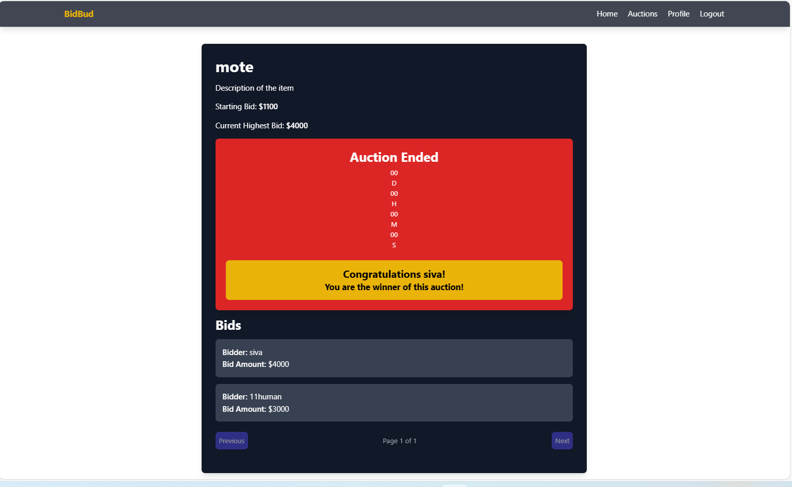
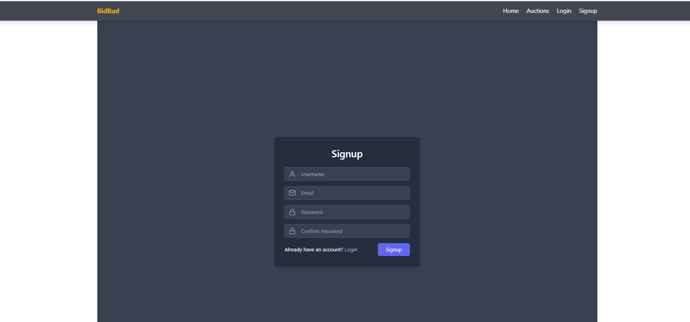
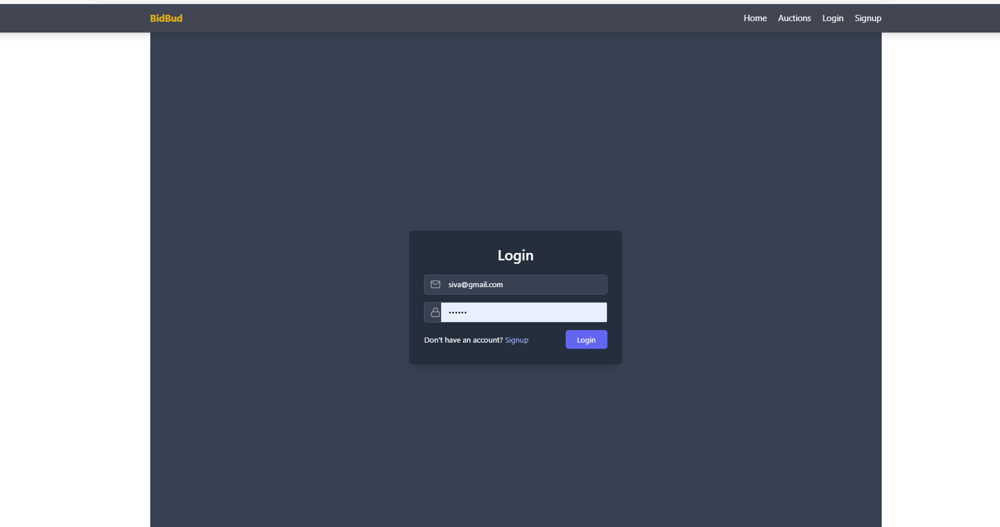
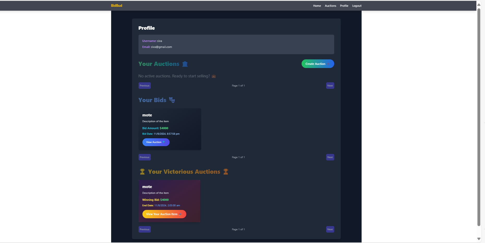
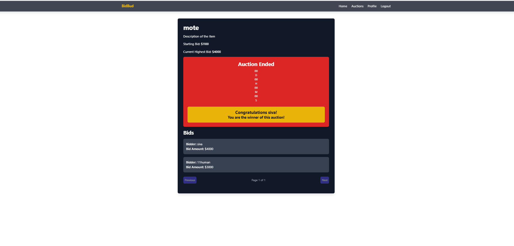
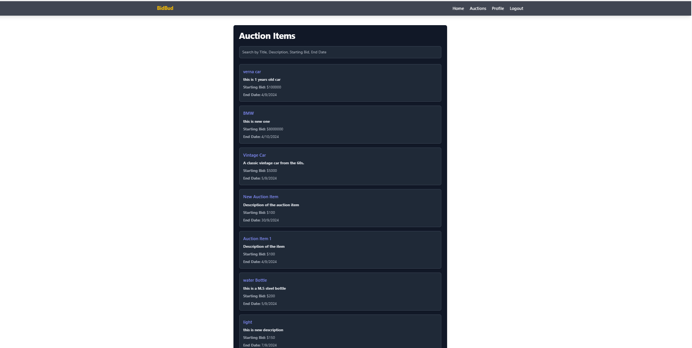

## Auction Flatform - Frontend

# It features:

- Frontend: Developed using React with Vite for the build tool.

# Frontend (frontend/)
- src/: Source code for the React application:
- components/: Contains React components for various parts of the UI.
- AuctionItem.jsx: Displays auction items.
- BidForm.jsx: Form for placing bids.
- Home.jsx: Home page component.
- NavBar.jsx: Navigation bar component.
- Signup.jsx: User registration component.
- contexts/: Contains context providers like AuthContext.jsx for managing user authentication state.
- App.jsx: Main component that sets up routing and the overall layout of the application.
- index.jsx: Entry point that renders App.jsx.
- main.jsx: Initializes the React application.
- tailwind.config.js: Configuration file for Tailwind CSS styling.
- vite.config.js: Configuration file for Vite, used for frontend build and development.
- index.html: Main HTML file that serves as the entry point for the frontend application.

# Installation

1. Navigate to the frontend directory:

`cd frontend`

2. Install dependencies:

`npm install`

3. Set up environment variables:

- Create a .env file in the frontend directory with the following content:

`TARGET=http://localhost:5000 or url of backend`

4. Start the frontend development server:

`npm run dev`

The frontend will run on http://localhost:5173.

